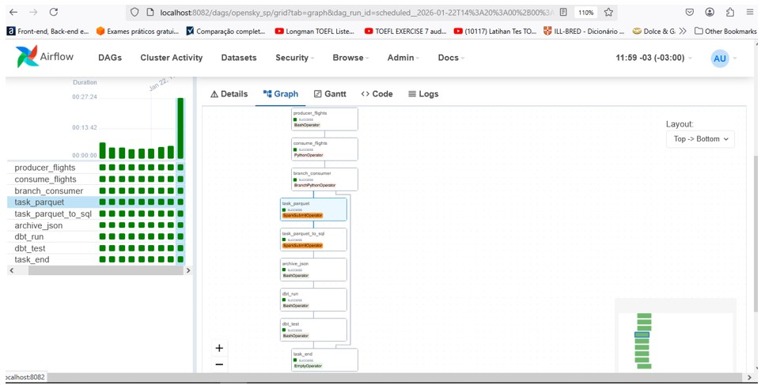
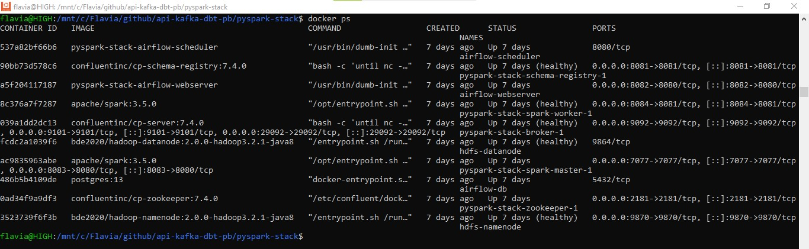

# ✈️ Real-Time Flight Analytics: Engenharia de Dados com dbt & Star Schema


## 📌 Sumário
- [Sobre o Projeto](#-sobre-o-projeto)
- [Arquitetura do Sistema](#arquitetura-do-projeto-sistema)
- [Arquitetura Medallion](#arquitetura-medallion)
- [Modelo de dados](#modelagem-de-dados)
- [O DW](#-camada-gold-o-data-warehouse-dw)
- [Modelagem Dimensional - Star Schema](#-modelo-dimensional-star-schema)
- [Processos de Negócio](#-processos-de-negócio)
- [Hierarquia](#-hierarquias)
- [Fluxo de Dados (ETL)](#-fluxo-de-dados)
- [Insights de Negócio](./docs/visualizacao_dados.md#dashboards-e-insights)
- [Conclusão e Próximos Passos](#-conclusão-e-próximos-passos)

>**NOTA:**
>Para ver as evidências do pipeline em execução e os Dashboards finais, 
>acesse: Detalhamento Visual e Artefatos  

## 🎯 Sobre o Projeto
Este projeto consiste em um pipeline de dados ponta a ponta para monitoramento e 
análise do tráfego aéreo na região de São Paulo, utilizando dados reais da API OpenSky Network. 
O objetivo principal foi transformar dados brutos de telemetria em um Data Warehouse estruturado, permitindo análises complexas sobre comportamento de vôo e ocupação do espaço aéreo.

### 🛠️ Características Principais

Lista das ferramentas:

  * Ingestão: Python + OpenSky API (fonte) (é feita de 5 em 5 minutos)
  * Mensageria: Apache Kafka (para o streaming dos dados).
  * HDFS: faz o papel de Data Lake distribuído, armazena arquivo parquet com dados recebidos pelo kafka e arquivos que controla o stage (voos que precisam ser processados), arquivo json com o schema de dados e arquivos temporários.
  * Spark cluster : deploy-mode client (master + workers) integrado ao Airflow.
  * Data Warehouse: SQL Server.
  * Transformação: dbt core (Data Build Tool) com modelos incrementais e Joins geográficos.
  * BI: Power BI (Análise de performance e horários de pico).
  * Airflow:  orchestrador de todo pipeline.
  * Docker: Todo o projeto foi containerizado utilizando Docker.  

Para garantir a escalabilidade e a qualidade das análises, implementei uma arquitetura de medalhão (Bronze, Silver e Gold) utilizando o dbt (data build tool):

  * Modelagem Dimensional: Estruturação Star Schema otimizado para BI,
  separando métricas volumétricas (Fatos) de contextos descritivos (Dimensões).
  * Hierarquias de Dados: Implementação de drill-down temporal (Ano > Mês > Hora) e  geográfico (Região > Estado > Aeroporto) para análises granulares.
  * Geofencing: Lógica SQL para identificação automática de presença em aeroportos (GRU/CGH) baseada em coordenadas geográficas.
  * Qualidade de Dados: Aplicação de testes automatizados de integridade, garantindo chaves únicas, campos não nulos e intervalos de valores aceitáveis (ex: velocidade e altitude) e 
  criação de logs do contagem de registros entrada vs saída.
  * Idempotência: dag preparada para rodar novamente em caso de erros, sem a duplicação 
  de dados no DW (utilização de dynamic overwrite e partições por data).
  * Schema Enforcement: o schema de dados é gravado em um JSON (SCHEMA_PATH) e utilizado na camada Silver.

### 📈 Impacto de Negócio

O modelo final permite responder a perguntas críticas como horários de pico de pousos/decolagens,  proporção de aeronaves estrangeiras vs. nacionais e identificação de comportamentos de voo (taxiando, cruzeiro ou aproximação), transformando coordenadas GPS em inteligência operacional.

## Arquitetura do Projeto (Sistema)
O ecossistema foi construído sobre Docker, utilizando o Docker Compose para orquestrar múltiplos containers. O Apache Airflow atua como o orquestrador central, gerenciando o ciclo de vida dos dados desde a captura via Python Producer até a modelagem final no dbt. A persistência dos dados brutos é feita em HDFS (Apache Spark), garantindo uma estrutura de Data Lakehouse resiliente.

```T
[ CAMADA DE INFRA ] -> Docker & Docker Compose (Isolamento)
[ CAMADA DE CONTROLE ] -> Apache Airflow (DAG Orchestration)
[ CAMADA DE INGESTÃO ] -> Python (Producer/Consumer) + Kafka (Stream)
[ CAMADA DE STORAGE ] -> HDFS (Parquet) + SQL Server (Bronze)
[ CAMADA DE ANALYTICS ] -> dbt (Silver/Gold)
[ CAMADA DE CONSUMO ] -> Power BI (Semantic Layer)
```
## Arquitetura Medallion
O projeto adota a Arquitetura Medallion, organizando o fluxo de dados em camadas de maturidade:

  * Bronze: Persistência dos dados brutos em HDFS (via Spark) e tabelas auxiliares em SQL Server.
  * Silver: Processos de limpeza, casting e padronização via dbt Staging.
  * Gold: Modelagem dimensional (Star Schema) otimizada para consumo em ferramentas de BI.

## Modelagem de Dados

### 🥇 Camada Gold: O Data Warehouse (DW)
Nesta etapa, os dados transformados são organizados em um ambiente analítico. O diagrama abaixo representa o fluxo final dentro do DW.

```T
[ RAW_DATABASE ]
   +------------------+
   | flights_raw      |
   | (Dado Bruto)     |
   +------------------+
            |
            |  dbt run (Staging)
            v
    [ ZONA_SILVER ]
   +------------------+
   | stg_flights      | 
   | (View/Limpeza)   | --- Limpeza básica, seleção e
   +------------------+     casting de tipos (Float/Int).
            |
            |  dbt run (Marts) + dbt test
            v
    [ ZONA_GOLD ]
   +------------------+         +-----------------------+
   | dim_aircrafts    | <-------|                       |
   | dim_airports     | <-------|      fct_flights      |
   | dim_calendar     | <-------|  (Star Schema Final)  |
   +------------------+         +-----------------------+
          
    Validação: 7 testes PASS (Unique, Not Null, Accepted Values)
```

### ⭐ Modelo Dimensional (Star Schema)
Para otimizar a performance das consultas no Power BI, estruturamos os dados seguindo o modelo Star Schema:

```t
DIM_AIRCRAFTS                    DIM_AIRPORTS
      +----------------+               +----------------+
      | aircraft_id    | <---+         | airport_code   | <---+
      | (PK)           |     |         | (PK)           |     |
      | model          |     |         | airport_name   |     |
      | manufacturer   |     |         | city           |     |
      +----------------+     |         +----------------+     |
                             |                                |
                             |       FCT_FLIGHTS              |
                             |      +----------------+        |
                             +----- | flight_pk (PK) |        |
                                    | aircraft_id(FK)|        |
               DIM_CALENDAR  +----- | airport_code(FK) -------+
              +-------------+       | flight_date(FK)|
              | flight_date | <---+ | speed_kmh      |
              | (PK)        |       | flight_status..|
              | day / month |       +----------------+
              | year        |
              +-------------+

      Modelagem Dimensional (Star Schema)
```

### Principais Componentes
### 📐 Dimensões

 * DIM_AIRCRAFTS - Hierarquia geográfica
 * DIM_AIRPORTS - Segmentação e localização
 * DIM_CALENDAR - Hierarquia temporal completa

### 📊 Tabelas Fato 

 * FCT_FLIGHTS - operações de voos


## 💼 Processos de Negócio

O processo de negócio no DW é modelado através de uma tabela fato. 

**Processo: FLIGHTS**

```Text
FCT_FLIGHTS
├─ Granularidade: 1 snapshot de telemetria por aeronave a cada registro captado.
├─ Frequência: Contínua (atualizada via stream Kafka/Spark em tempo real).
├─ Tipo: Transactional Fact Table (telemetria geoespacial).
├─ Volume: Cresce conforme o tráfego aéreo nos polígonos de monitoramento de SP.
└─ Perguntas respondidas:
   • Quantos aviões únicos sobrevoam São Paulo por hora/período?
   • Qual o volume de tráfego aéreo por aeroporto (GRU vs CGH)?
   • Qual a velocidade média dos voos em procedimento de aproximação?
   • Aeronaves estrangeiras têm perfil de altitude diferente das nacionais?
   • Qual o horário de pico de pousos e decolagens durante a semana?
   • Qual a proporção de aeronaves em solo vs. em voo por faixa horária?
   • Como a altitude média varia para voos que cruzam a região de SP?
```

## 📊 Hierarquias
**1. Hierarquia Temporal (DIM_CALENDAR)**

Esta estrutura permite que o usuário saia de uma visão anual e chegue até o detalhe da hora exata do voo.

```T 
Hierarquia Temporal
Ano (2026)
 └── Trimestre (Q1, Q2, Q3, Q4)
      └── Mês (Janeiro, Fevereiro, ...)
           └── Dia (1, 2, 3, ..., 31)
                └── Período do Dia (Manhã, Tarde, Noite)
                     └── Hora (0, 1, 2, ..., 23)
```
**2. Hierarquia Geográfica (DIM_AIRPORTS)**

Essencial para o seu estudo sobre os aeroportos de São Paulo, 
permitindo agrupar por região ou aeroporto específico.

```T
Hierarquia Geográfica
Região (Sudeste)
 └── Estado (São Paulo)
      └── Cidade (São Paulo)
           └── Aeroporto (Guarulhos, Congonhas, Viracopos)
                └── Código IATA (GRU, CGH, VCP)
```
**3. Hierarquia de Aeronaves (DIM_AIRCRAFTS)**

Organiza a frota para responder sobre a origem do tráfego aéreo.

```T
Hierarquia de Aeronaves
Categoria (Nacional / Estrangeiro)
 └── Continente (América do Sul, Europa, ...)
      └── País de Origem (Brazil, United States, ...)
           └── ID da Aeronave (ICAO24)
```

**4. Hierarquia de Navegação Analítica (FCT_FLIGHTS)**

Organiza os dados para identificar em qual fase do voo o sinal foi capturado, permitindo análises de segurança e eficiência em aproximações.

```T
Hierarquia de Navegação
Status do Voo (Em Voo / No Solo)
 └── Comportamento (Cruzeiro, Subida, Descida / Aproximação, Nivelado, Táxi)
      ├── Faixa de Altitude (Baixa, Média, Alta Altitude)
      └── Faixa de Velocidade (Lento, Cruzeiro Médio, Alta Velocidade)
```

 * flight_status: Separação macro entre aeronaves operando em pista ou em espaço aéreo.
 * flight_behavior: Identifica a fase do voo utilizando a lógica de vertical_rate (taxa de subida/descida).
 * altitude_tier e speed_tier: Categorização técnica que transforma dados contínuos (números) em dados categóricos (grupos), facilitando a criação de filtros e dashboards executivos.

**Métricas Principais:**

Utiliza Cálculos DAX otimizados no POWER BI (Camada semântica).

Para garantir a precisão dos dados, o projeto não utiliza contagens simples de registros, mas sim medidas calculadas que tratam a natureza dos dados de aviação:

 * Total de Sinais: COUNT(flight_pk)
 * Aeronaves Ativas: DISTINCTCOUNT(aircraft_id)
 * Velocidade Média: AVG(speed_kmh)
 * Pico de Tráfego: MAX(unique_aircrafts) por hour_24

## 🔄 Fluxo de Dados
**1. Sistema Fonte (API EXTERNA)**

 * OpenSKy: Coleta de dados via REST API para capturar o estado global (states) das aeronaves na Bounding Box de São Paulo.

**2. Extração (ETL - Extract)**

 Ingestão e Mensageria (Real-time Layer):

 * Python Producer (task_producer): Atua como o Ingestor. Ele faz a requisição à API OpenSky e publica as mensagens brutas no tópico do Kafka.

 * Kafka Consumer (task_consume): Ele faz parte da extração porque é quem "retira" o dado da fila (mensageria) e o traz para o sistema de arquivos local (JSON) para ser processado.

 Orquestração e Otimização de Recursos:

 * Task branch_consumer: BranchOperator para verificar se houve captura de dados antes de subir o cluster Spark, economizando recursos computacionais.

**3. Transformação (ETL - Transform)**

 * A. Processamento Distribuído (Spark)

    * Processamento Spark (task_parquet): Realiza a primeira transformação estrutural, convertendo os arquivos semi-estruturados (JSON) em Apache Parquet. Isso otimiza o armazenamento no HDFS e prepara os dados para leitura em alta performance.
    
 * B. Modelagem Analítica (dbt)

    Aqui acontece a transformação de negócio (Silver e Gold):

    * dbt run (task_dbt_run): Executa a lógica SQL (Geofencing, Tiers de Altitude, Status de Voo).

    * dbt test (task_dbt_test): Garante a qualidade (Data Quality) antes do dado chegar ao Power BI.

**4. Carga (ETL - Load)**

A carga é realizada em dois momentos cruciais para garantir a disponibilidade do dado:

 * Ingestão no Data Warehouse (task_parquet_to_sql): O Spark atua como o conector, movendo os dados processados do HDFS diretamente para a tabela Bronze (FLIGHT_RAW) do SQL Server via JDBC.

 * Garantia de Qualidade (task_dbt_test): Antes de considerar a carga finalizada, são executados testes de integridade (Unique, Not Null, Accepted Values). Se um teste falha, o pipeline é interrompido, impedindo que dados corrompidos cheguem ao Dashboard.

 * Arquivamento (task_archive): O arquivo original é movido para uma zona de "Processados", mantendo o Staging limpo e garantindo a idempotência do pipeline (o dado não será processado duas vezes).

**5. Análise e Consumo**

O pipeline processa dados brutos da API OpenSky utilizando scripts Python e Spark para realizar o geofencing (delimitação geográfica) e a limpeza dos dados. O objetivo central é o monitoramento da malha aérea de alta densidade da Grande São Paulo, transformando registros de telemetria bruta em indicadores de performance aeroportuária.

Os dados são recebidos via API em formato JSON estruturado como um vetor de vetores (Array of Arrays). Cada sub-vetor representa um State Vector individual, que é então mapeado para colunas nomeadas e tipadas durante a fase de processamento Spark, garantindo a integridade do esquema (Schema Enforcement).

O volume significativo de dados classificados como Espaço Aéreo Geral (N/A) reflete a alta densidade do tráfego de sobrevoo na região metropolitana de São Paulo. O modelo foi desenhado para filtrar e identificar com precisão apenas as aeronaves em Operação Terminal (pouso, decolagem e táxi) nos três principais hubs (GRU, CGH e VCP), descartando os voos em rota de cruzeiro que não interagem com os aeroportos monitorados.

A análise das velocidades médias no Aeroporto de Congonhas (SBSP) revelou valores significativamente baixos (aprox. 18 m/s). Embora o campo category da API OpenSky não estivesse disponível no dataset para segmentação direta, a baixa velocidade, somada ao perfil operacional de SBSP (maior hub de helicópteros e aviação executiva do Brasil), sugere uma forte presença de aeronaves de pequeno porte e tráfego de solo na amostra coletada.

**-> Diagrama Completo do Fluxo:**

```T
Airflow (Orquestrador Docker)
                         |
                         v
    +---------------------------------------------------+
    |  OpenSky API ──> Producer (Python) ──> Kafka      |
    |                                         |         |
    |  JSON (Local) <── Consumer (Python) <───┘         |
    |      |                                            |
    |      └──> Spark (Batch Processing)                |
    |             └──> HDFS (Armazenamento Parquet)     |
    |                    └──> SQL Server (Bronze)       |
    |                                |                  |
    |                          dbt (Analytics)          |
    +---------------------------------------------------+
                         |
                         v
                [ Camada de Visualização ]
                (Power BI - Star Schema)
```
**-> Diagrama detalhado:**

```T
[ DIRETÓRIO DE SCHEMAS ]
               |
      flight_schema.py (Definição StructType)
               |
               v
+-----------------------------------------------------------------------+
|                       ORQUESTRADOR AIRFLOW (DAG)                      |
|                                                                       |
|  1. [PRODUCER] ----> 2. [CONSUMER]                                    |
|     (Kafka)             (Kafka)                                       |
|                            |                                          |
|                            v                                          |
|                +-----------------------+                              |
|                |   DIRETÓRIO STAGING   |                              |
|                | flights_{{ts}}.json   |                              |
|                +-----------+-----------+                              |
|                            |                                          |
|             (Branch: Se count > 0 segue...)                           |
|                            |                                          |
|                            v                                          |
|                3. [TASK SAVE PARQUET] <--- (Usa flight_schema.py)     |
|                            |                                          |
|                +-----------v-----------+                              |
|                |      HDFS STORAGE     |                              |
|                | data/flights/parquet  |                              |
|                +-----------+-----------+                              |
|                            |                                          |
|                4. [TASK PARQUET TO SQL]                               |
|                            |                                          |
|                +-----------v-----------+                              |
|                |   SQL SERVER BRONZE   |                              |
|                +-----------+-----------+                              |
|                            |                                          |
|                5. [TASK ARCHIVE JSON]                                 |
|               (Move e Limpa o Staging)                                |
|                            |                                          |
|                +-----------v-----------+                              |
|                |  DIRETÓRIO PROCESSED  |                              |
|                | (Histórico de JSONs)  |                              |
|                +-----------+-----------+                              |
|                            |                                          |
|                6. [DBT RUN / TEST]                                    |
|               (Bronze -> Silver -> Gold)                              |
|                                                                       |
+-----------------------------------------------------------------------+
```

**-> Manutenção do Pipeline:**

    Área de Staging(diretório): Implementada para isolar os dados brutos antes da conversão para Parquet.

    Cleanup: O pipeline foi configurado para limpar a staging após o processamento bem-sucedido. Arquivos remanescentes nesta pasta indicam interrupções no ciclo de processamento, facilitando o rastreio de falhas (reprocessamento).


-> Diagrama de Fluxo do DBT: 

```T
[ CAMADA BRONZE ]            [ CAMADA SILVER ]                [ CAMADA GOLD ]
   (SQL Server)               (SQL Server)                    (Modelagem Star-SQL Server)
      |                            |                                |
+--------------+             +--------------+                +-----------------+
| RAW.         |             | STG_         |                | DIM_AIRCRAFTS   |
| FLIGHTS_RAW  |             | FLIGHTS      |                | (Tabela)        |
|--------------|    dbt run  |--------------|                |-----------------|
| id_surrogate |------------>| flight_pk    |-----+--------> | aircraft_id (PK)|
| icao24       |  (Limpeza e | aircraft_id  |     |          | origin_country  |
| callsign     |    Casting) | airport_code |     |          | category        |
| velocity     |             | speed_kmh    |     |          | continent...    |
| ...          |             | flight_date  |     |          +-----------------+
+--------------+             +--------------+     |                  ^
                                    |             |                  |
                                    |             |          +-----------------+
                             [ dbt test ]         |          |   FCT_FLIGHTS   |
                             (Data Quality)       |          |    (Tabela)     |
                                    |             |          |-----------------|
                                    |             +--------> | flight_pk (PK)  |
                                 dbt run          |--------> | aircraft_id (FK)|
                               (Geofencing)       |--------> | airport_code(FK)|
                                    |             |--------> | flight_date (FK)|
                                    v             |          | latitude        |
                             +--------------+     |          | longitude       |
                             |  TABELAS GOLD|-----+          | altitude_baro   |
                             +--------------+                | vertical_rate   |
                                    |                        | on_ground       |
                                    |                        | flight_status   |
                                    v                        +-----------------+
                             +--------------+                        |
                             | DIM_AIRPORTS | <----------------------+
                             | DIM_CALENDAR | <----------------------+
                             +--------------+

      [ PROCESSO DBT ]             [ QUALIDADE ]             [ VISUALIZAÇÃO ]
      - Sources (Raw)           - Unique / Not Null          - Power BI
      - Models (SQL)            - Accepted Values            - Dashboards
      - Materialization         - Relationships              - Analytics
```

**6. Visualização do Airflow e Containers no Docker**





## 📚 Conclusão e Próximos Passos
Este projeto demonstra a implementação de uma arquitetura de dados moderna (Modern Data Stack), partindo da ingestão de eventos em tempo real até a entrega de insights estratégicos. 

A separação clara entre a **Camada de Dados (SQL/dbt)** e a **Camada Semântica (Power BI)** permite que o sistema seja escalável, permitindo a adição de novos aeroportos e métricas sem a necessidade de reestruturar todo o pipeline. A utilização de modelagem Dimensional (Star Schema) garante que análises complexas, como o cruzamento de performance técnica com a origem da frota, sejam realizadas com alta performance.

Atualmente, a dimensão de aeronaves (DIM_AIRCRAFTS) foca na identificação única via ICAO24 e País de Origem. Um roadmap futuro para este projeto inclui o cruzamento com bases externas (como a da ANAC ou OpenSky DB) para enriquecimento de dados com Modelo, Fabricante e Capacidade de Passageiros.

>**NOTA:**
>Para ver as evidências do pipeline em execução e os Dashboards finais, 
>acesse: Detalhamento Visual e Artefatos  
