# 📊 Detalhamento Visual e Artefatos do Projeto

Este documento apresenta as evidências técnicas do pipeline, desde a ingestão do dado bruto até a entrega final no Power BI.

## 1. Evidência de Ingestão (Bronze)
O dado é capturado via API e armazenado inicialmente em formato JSON. Abaixo, um exemplo do arquivo json persistido nos diretórios de controle (**Raw**, **Staging** e **Processed**):

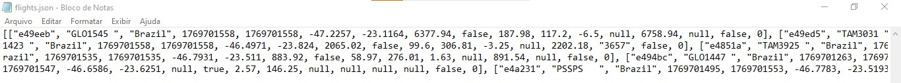

> **Exemplo de como ficam os diretórios para gravar o arquivo flights.json (HDFS/Local):**
> `drwxr-xr-x - airflow supergroup 0 2026-01-29 15:46 /data/flights/raw/dt=2026-01-29`
> `-rw-r--r-- 1 airflow supergroup 3306 2026-01-29 15:46 /data/flights/raw/dt=2026-01-29/flights.json`

No ambiente **Staging** e **Processed**, os arquivos (json) são nomeados com timestamp único para garantir a rastreabilidade:  
`flights_20260129T154000.json`

### Layout do Arquivo JSON Salvo no Pipeline
O arquivo json salvo no pipeline possui os campos abaixo:

```text
+-------+-------------------+---------+-------------------------------------------------------+
| ÍNDEX | CAMPO             | TIPO    | DESCRIÇÃO                                             |
+-------+-------------------+---------+-------------------------------------------------------+
| 0     | icao24            | String  | Identificador único de 24 bits da aeronave (Hex)      |
| 1     | callsign          | String  | Indicativo de chamada (Ex: TAM3645)                   |
| 2     | origin_country    | String  | País de origem baseado no código ICAO                 |
| 3     | time_position     | Integer | Timestamp da última atualização de posição            |
| 4     | last_contact      | Integer | Timestamp do último sinal recebido (geral)            |
| 5     | longitude         | Float   | Longitude WGS-84 em graus decimais                    |
| 6     | latitude          | Float   | Latitude WGS-84 em graus decimais                     |
| 7     | baro_altitude     | Float   | Altitude barométrica em metros                        |
| 8     | on_ground         | Boolean | Indica se a aeronave está no solo (True/False)        |
| 9     | velocity          | Float   | Velocidade em relação ao solo em m/s                  |
| 10    | true_track        | Float   | Direção da aeronave em graus (0° = Norte)             |
| 11    | vertical_rate     | Float   | Taxa de subida/descida em m/s                         |
| 12    | sensors           | Array   | IDs dos receptores (pode ser nulo)                    |
| 13    | geo_altitude      | Float   | Altitude geométrica (GPS) em metros                   |
| 14    | squawk            | String  | Código do transponder (4 dígitos)                     |
| 15    | spi               | Boolean | Indicador de voo para fins especiais                  |
| 16    | position_source   | Integer | Origem da posição (0=ADS-B, 1=ASTERIX, 2=MLAT, etc.)  |
| ---   | estArrivalAirport | String  | *Campo calculado via Geofencing (Ex: SBSP, SBGR)      |
+-------+-------------------+---------+-------------------------------------------------------+
```

> [!IMPORTANTE]
>Campo category da API OpenSky: Embora previsto na documentação da OpenSky API (campo 17), 
>este dado é opcional e não foi fornecido pelos sensores durante a coleta deste dataset. 
>A análise de perfil de frota foi realizada de forma inferencial através da correlação entre velocity e on_ground.


Abaixo, é mostrado como é configuração do arquivo JSON (mesmo formato do arquivo json recebido da OPENSKY API):
```text
{
  "time": 1765922995,
  "states": [
    ["e4944f", "TAM3645 ", "Brazil", ...],  // Vetor do Avião A (Índice 0)
    ["e49eee", "GLO1371 ", "Brazil", ...],  // Vetor do Avião B (Índice 1)
    ["e49374", "PRRDG   ", "Brazil", ...]   // Vetor do Avião C (Índice 2)
  ]
}
```

## 2. Processamento Spark & Armazenamento (HDFS)
Aqui é mostrado o esquema do arquivo Parquet gerado pelo Spark após a limpeza inicial:

```text
root
 |-- icao24: string (nullable = true)
 |-- callsign: string (nullable = true)
 |-- origin_country: string (nullable = true)
 |-- time_position: long (nullable = true)
 |-- last_contact: long (nullable = true)
 |-- longitude: double (nullable = true)
 |-- latitude: double (nullable = true)
 |-- baro_altitude: double (nullable = true)
 |-- on_ground: boolean (nullable = true)
 |-- velocity: double (nullable = true)
 |-- heading: double (nullable = true)
 |-- vertical_rate: double (nullable = true)
 |-- sensors: string (nullable = true)
 |-- geo_altitude: double (nullable = true)
 |-- squawk: string (nullable = true)
 |-- spi: boolean (nullable = true)
 |-- position_source: long (nullable = true)
 |-- processing_date: date (nullable = true)
``` 

#### Amostra dos Dados Processados (Camada Trusted/Parquet):

Abaixo, uma amostra dos dados estruturados após o processamento Spark, prontos para análise:


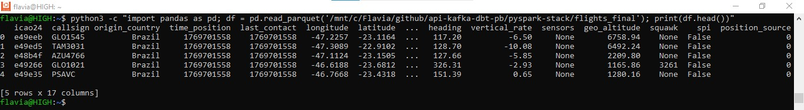


## 3. Modelagem Dimensional (SQL Server / Gold)
Abaixo, a visualização das tabelas materializadas pelo dbt(Fato e Dimensões) no SQL Server:

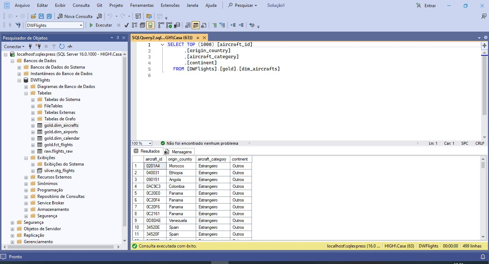
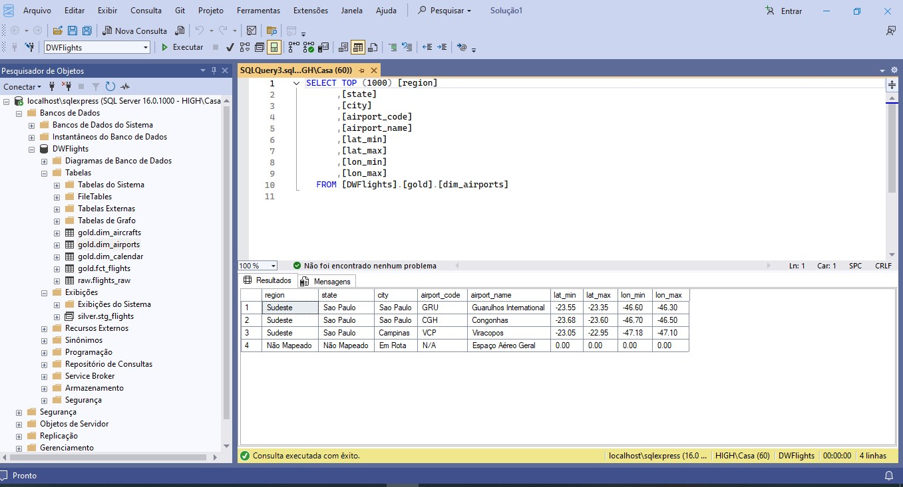

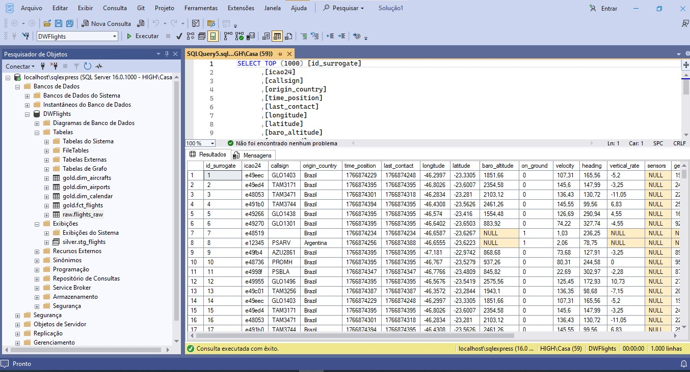
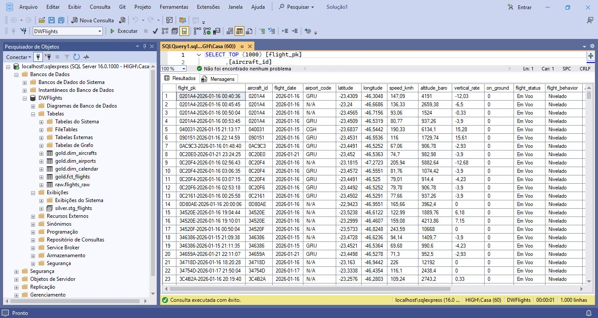
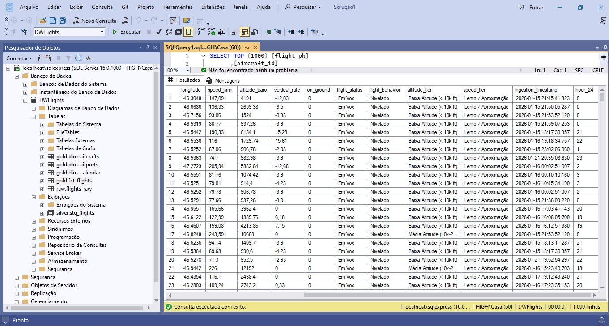


## 4. Dashboards e Insights (Power BI)
A camada final de consumo, onde o Star Schema permite filtros dinâmicos por país, categoria de aeronave e aeroporto. 
Nessas condições foram gerados os seguintes dashboards:

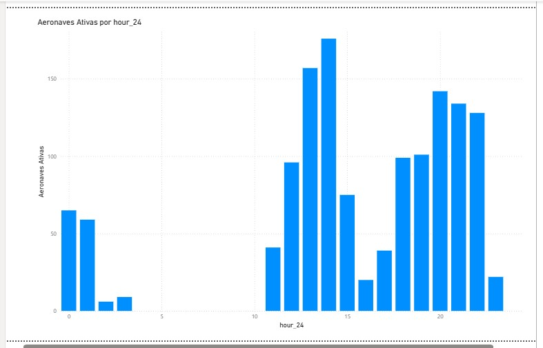
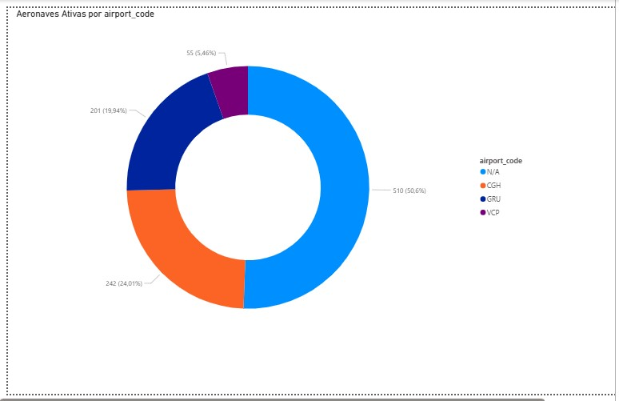

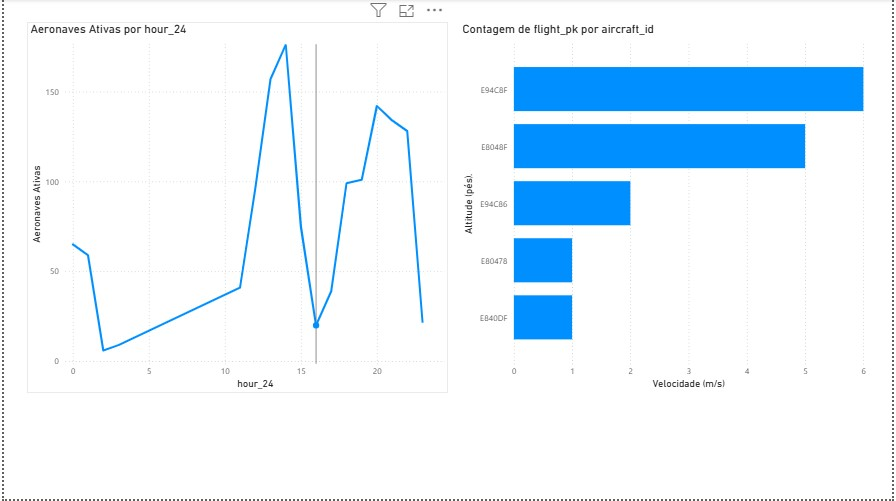
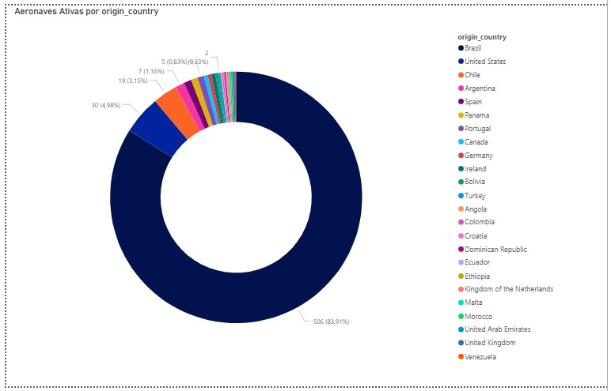
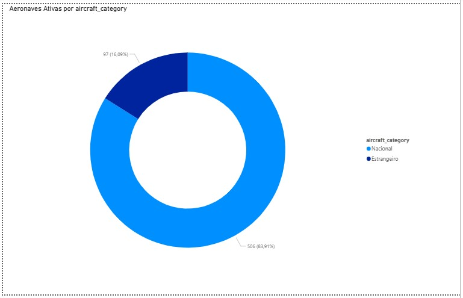


### 💡 Principais Insights de Negócio

1. **Janelas de Pico e Saturação (Análise Temporal)**
   * **Insights:** O gráfico de "Aeronaves Ativas por hour_24" revela três picos claros de operação: um início de manhã (por volta das 12h-14h UTC), um pico vespertino e um crescimento acentuado à noite (20h-22h).
   * **Valor de Negócio:** Permite prever horários de maior carga de trabalho para equipes de solo e identificar janelas de ociosidade na madrugada (05h-10h UTC), ideais para manutenções programadas.

2. **Eficiência de Geofencing e Distribuição por Hub**
   * **Insights:** Cerca de 50,6% das aeronaves detectadas estão em espaço aéreo geral (N/A), enquanto 24% estão vinculadas a Congonhas (CGH) e 20% a Guarulhos (GRU).
   * **Valor de Negócio:** Valida que o Geofencing está funcionando corretamente. Nota-se que CGH, apesar de ser um aeroporto menor que GRU, possui uma densidade de aeronaves ativas muito alta devido à sua localização central.

3. **Correlação Física: Velocidade vs. Altitude**
   * **Insights:** O gráfico de dispersão mostra uma correlação positiva clara: quanto maior a altitude, maior a velocidade de cruzeiro.
   * **Valor de Negócio:** Identifica anomalias operacionais. Aeronaves com alta velocidade em baixas altitudes podem indicar procedimentos de aproximação rápida ou necessidade de monitoramento de segurança.

4. **Perfil da Frota e Origem**
   * **Insights:** A operação é massivamente nacional (83,9%). Entretanto, há uma cauda longa de aeronaves estrangeiras (Chile, EUA, Argentina, etc.).
   * **Valor de Negócio:** Demonstra a importância dos hubs paulistas como portões de entrada internacionais e reforça a malha doméstica como motor principal do volume de dados.

5. **Desempenho por Aeroporto (Velocidade Média)**
   * **Insights:** A velocidade média em Congonhas (CGH) é significativamente menor (18 m/s) em comparação a Guarulhos (90 m/s).
   * **Valor de Negócio:** Sugere um numero significativo de aeronaves menores que exigem aproximações mais lentas, e possivelmente, também, de helicópteros e movimentação de solo (táxi).